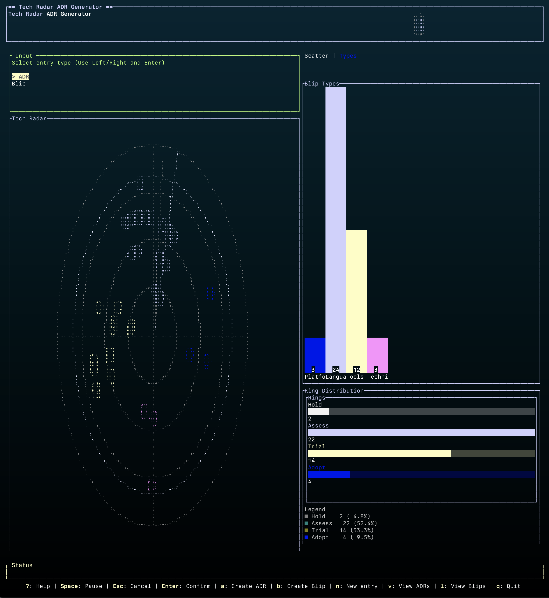
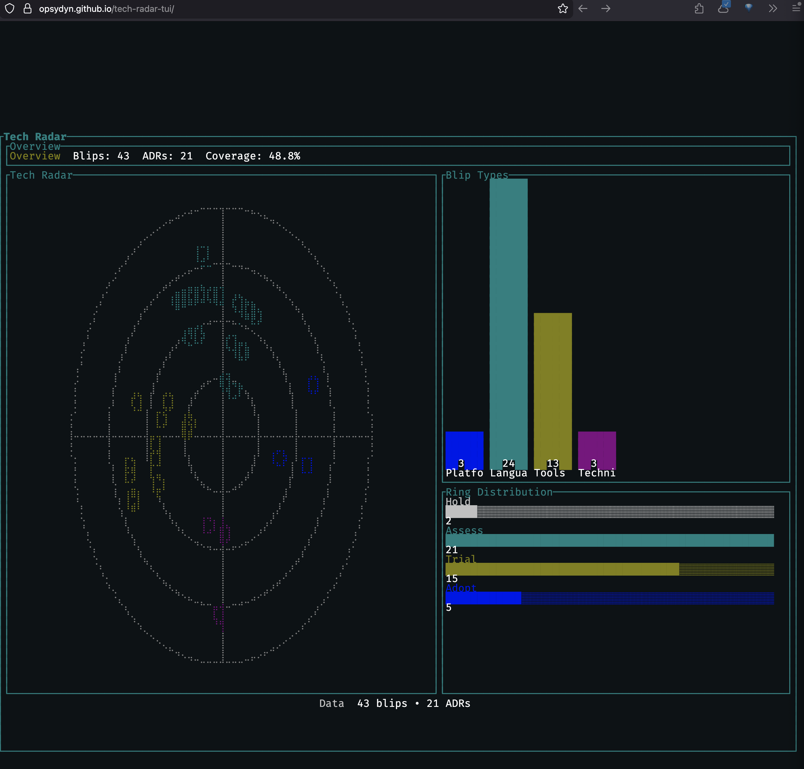

# Tech Radar TUI

[](https://github.com/opsydyn/tech-radar-tui/releases/latest)
[](https://github.com/opsydyn/tech-radar-tui/releases)
[](https://github.com/opsydyn/tech-radar-tui/actions/workflows/ci.yml)
[](LICENSE)
[](https://github.com/opsydyn/tech-radar-tui/releases)
[](https://github.com/opsydyn/tech-radar-tui/commits/master)
[](https://github.com/opsydyn/tech-radar-tui)
[](https://www.rust-lang.org)


Keyboard-driven terminal UI for creating Architectural Decision Records (ADRs) and Tech Radar blips with quadrant/ring metadata, radar visualization, and quick navigation.

## Features



- Create ADRs and blips with structured front matter
- Quadrant + ring selection with live radar placement
- Charts and radar visualizations
- Headless stats mode for CI or scripts
- Built with [Ratatui](https://ratatui.rs/) ([GitHub](https://github.com/ratatui/ratatui))
- Inspired by the [Thoughtworks Technology Radar](https://www.thoughtworks.com/radar)

## Team workflow

- Treat Markdown as the long-lived record and the SQLite DB as a shared index; commit both so teams stay in sync.
- Keep `adrs/` and `blips/` in version control and review them like code (ADR status changes should be explicit).
- Store the SQLite file in the repo (default `adrs.db`) and update it when you add or edit entries.
- Prefer one logical change per commit (e.g., new blip + optional ADR + DB update) for clean review history.
- Keep commit messages descriptive (why the tech moved rings/why the decision changed).
- Resolve conflicts by picking the latest Markdown edits, then re-open the TUI to refresh DB state.
- Use Settings to align team paths (`ADR_DIR`, `BLIP_DIR`, `DATABASE_NAME`) so generated files land in the same repo.
- In CI or pre-release, run headless stats to sanity-check totals before tagging a release.
- Use a git-first approach: branch, review, merge, and let the DB + Markdown travel together for governance.

## Working with agents

- Share the repo and run the TUI in headless mode so agents can read stats and propose updates.
- Ask agents to draft blips/ADRs as Markdown first, then use the TUI to register them in the DB.
- Keep agent-generated changes small and reviewable (one blip or ADR per change).
- Use consistent naming so agents can find the right record to edit.
- Treat agents like contributors: require PRs, review diffs, and keep commit messages clear.

## Quick start

```bash
moon run tui:dev
```

## Run with Cargo

Clone the repo and build/run locally:

```bash
git clone https://github.com/opsydyn/tech-radar-tui.git
cd tech-radar-tui
cargo run --release --manifest-path apps/tui/Cargo.toml
```

Or run with Moon:

```bash
moon run tui:dev
```

## Headless stats

Text output:

```bash
moon run tui:headless
```

```bash
cargo run --release --manifest-path apps/tui/Cargo.toml --bin ratatui_adr-gen -- --headless
```

JSON output (LLM-friendly):

```bash
cargo run --release --manifest-path apps/tui/Cargo.toml --bin ratatui_adr-gen -- --headless --json
```

Full export (for web UIs):

```bash
cargo run --release --manifest-path apps/tui/Cargo.toml --bin ratatui_adr-gen -- --export > apps/web/radar.json
```

## Flags

- `--headless`: Print stats and exit
- `--json`: Print headless stats as JSON
- `--export`: Export full radar data as JSON
- `--db <path>`: Override database path
- `--adr-dir <path>`: Override ADR output directory
- `--blip-dir <path>`: Override Blip output directory
- `--debug`: Enable debug logging

## CLI options

```bash
ratatui_adr-gen --headless
ratatui_adr-gen --headless --json
ratatui_adr-gen --export
ratatui_adr-gen --db /path/to/adrs.db
ratatui_adr-gen --adr-dir ./adrs --blip-dir ./blips
ratatui_adr-gen --debug
```

## Web radar (Ratzilla)



Local dev:

1. Export radar data:

```bash
cargo run --release --manifest-path apps/tui/Cargo.toml --bin ratatui_adr-gen -- --export > apps/web/radar.json
```

2. Install web tooling:

```bash
cargo install trunk
rustup target add wasm32-unknown-unknown
```

3. Run the web UI:

```bash
cd apps/web
trunk serve
```

Open `http://localhost:8080` to view the radar.

GitHub Pages:

- Pushes to `master` build and deploy the web radar via `.github/workflows/pages.yml`.
- The workflow runs the export, builds `apps/web`, and publishes `apps/web/dist`.
- Pages is served under `/tech-radar-tui/`, so the web bundle uses `public_url` to match.

## Install

Download the latest release binary for your platform from the GitHub Releases page and place it on your PATH:

<https://github.com/opsydyn/tech-radar-tui/releases>

- Linux: `tech-radar-tui-linux`
- macOS: `tech-radar-tui-macos`
- Windows: `tech-radar-tui-windows.exe`

Example (Linux/macOS):

```bash
curl -L -o tech-radar-tui https://github.com/opsydyn/tech-radar-tui/releases/download/v0.2.0/tech-radar-tui-linux
chmod +x tech-radar-tui
./tech-radar-tui
```

macOS first run

```bash
chmod +x tech-radar-tui-macos
xattr -d com.apple.quarantine tech-radar-tui-macos
./tech-radar-tui-macos
```

If macOS still blocks the app: System Settings → Privacy & Security → "Open Anyway" for tech-radar-tui-macos.

## Release checks and tags

```bash
make release-check
```

## Releases with release-plz

We use release-plz with conventional commits to automate versioning and tags.

- `fix:` → patch release
- `feat:` → minor release
- `feat!:`/`fix!:` or `BREAKING CHANGE:` in the body → major release

Workflow:

1. Merge conventional commits to `master`.
2. release-plz opens a Release PR with version bumps + changelog.
3. Merge the Release PR to publish the release and tag.

If you need to cut a release manually, bump the version in `apps/tui/Cargo.toml` and let the workflow tag it.

## Project layout

- App: `apps/tui`
- DB + migrations: `apps/tui/src/db`
- UI: `apps/tui/src/ui`

For detailed controls and usage, see `apps/tui/README.md`.

## Git hooks

This repo uses Moon VCS hooks. Hooks are generated by Moon and synced into `.git/hooks`.

```bash
moon sync hooks
```
